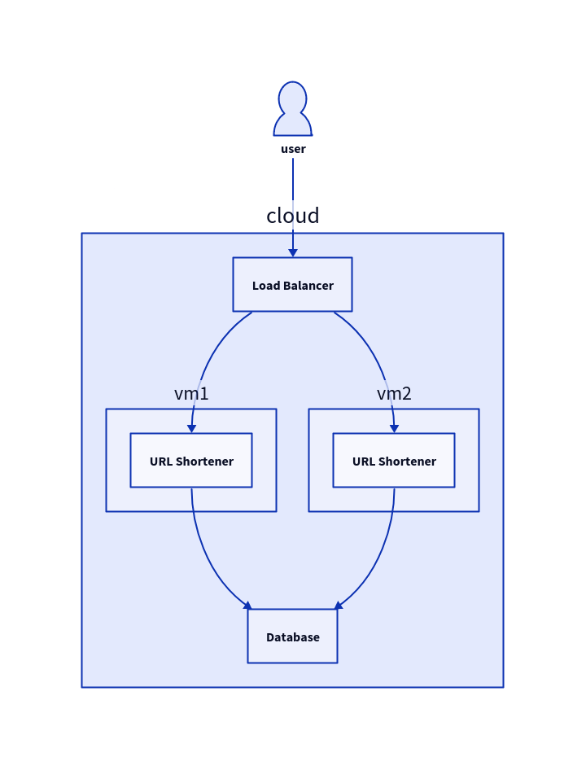

# Introduction
This document outlines the design and architecture of a URL shortener system capable of handling a high volume of requests. The system is expected to receive 1 million write requests (URL shortening) and 10 million read requests (URL resolution) per day.

# Requirements
- Handle 1 million write requests (URL shortening) per day
- Handle 10 million read requests (URL resolution) per day
- Generate unique, base62-encoded identifiers for shortened URLs with a minimum length of 7 characters (62^7 = 3.5 trillion possible combinations)
- Persistent storage for storing long URLs and their corresponding shortened URLs
- For Simplicity user can't delete / update shortened URLs

# System Architecture
## High Level design


# Database

## Table
```
CREATE TABLE urls (
    id bigint PRIMARY KEY AUTOINCREMENT,
    long_url TEXT NOT NULL,
    short_url TEXT UNIQUE NOT NULL,
    created_at TIMESTAMP DEFAULT CURRENT_TIMESTAMP
);
```

# API Design
## POST /shorten: Create a new shortened URL
Must be capable of handling 1 million write requests per day or ~= 11 requests per second. 
  
## GET /shorten/:key Resolve a shortened URL
Must be capable of handling 10 million read requests per day or ~= 110 requests per second. This aproach only able on framework / language that support concurrency, on my previous attempt using Flask i havea really bad performance ~= 20rps for get Request. And i choose to rewrite it entirely using FastAPI which is able even into 200rps which is 17.28 million requests per day or 900% of Improvement.

# Storage Requirements
Assuming an average long URL length of 100 characters (including the protocol, domain, path, and query parameters), and a short URL length of 7 characters (base62-encoded), the approximate storage requirements can be calculated as follows:

- For 1 million write requests per day:
	- Long URLs: 1,000,000 * 100 bytes = 100 MB
	- Short URLs: 1,000,000 * 7 bytes = 7 MB
	- ID: 1,000,000 * 8 bytes = 8 MB
	- Created_at: 1,000,000 * 8 bytes = 8 MB
	- Total: ~123 MB per day

Assuming a retention period of 1 year, the total storage requirement would be approximately 43.85 GB (123 MB * 365 days).

# Rate Limiting
To protect the system from abuse and excessive load, a rate limiting mechanism will be implemented at the load balancer level. The rate limiting strategy will be based on client IP addresses and will use a fixed window counter algorithm.

The rate limiting parameters will be as follows:
- Write Requests (URL Shortening): Rate limit of 100 requests per minute, with a burst of 20 requests allowed.
- Read Requests (URL Resolution): Rate limit of 1000 requests per minute, with a burst of 200 requests allowed.

The rate limiting logic will be implemented using NGINX and Lua scripts. The Lua scripts will maintain a shared memory zone to store rate limiting counters for each client IP address and window combination.
If a client exceeds the configured rate limit, their requests will be temporarily blocked, and an appropriate HTTP status code (e.g., 429 Too Many Requests) will be returned.

# Future Enhancements
## Caching
Implementing a caching layer (e.g., Redis or Memcached) to improve performance for frequently accessed URLs With Least Recently Used (LRU) cache.
